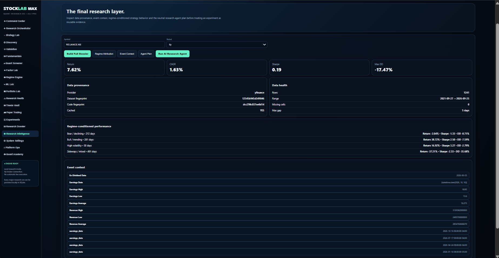
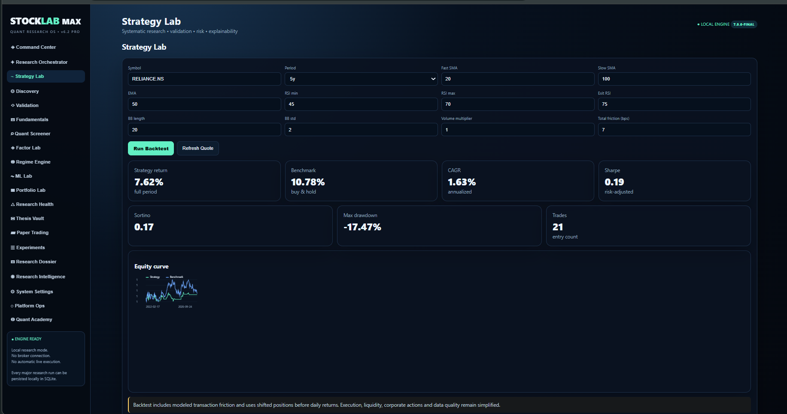

# StockLab MAX

### AI-Powered Quantitative Research & Experimentation Platform

StockLab MAX is a quantitative research workstation designed to bring market data, fundamental analysis, technical research, strategy development, backtesting, validation, machine learning, portfolio analytics, research provenance, AI-assisted research, and paper trading into one workflow.

> **Research first. Evidence driven. Reproducible by design.**

---

## 📸 Screenshots

### Research Orchestrator


### Research Intelligence



### Strategy Lab



---

## 🚀 What StockLab MAX Does

StockLab MAX follows a research workflow:

```text
Hypothesis
    ↓
Research Agent
    ↓
Fundamentals + Technicals + Events
    ↓
Screening
    ↓
Strategy
    ↓
Backtest
    ↓
Train / Test
    ↓
Walk-Forward Validation
    ↓
Robustness Analysis
    ↓
Monte Carlo
    ↓
Regime Analysis
    ↓
ML / Factors
    ↓
Portfolio & Risk
    ↓
Research Health
    ↓
Experiment Vault
    ↓
Research Dossier
    ↓
Paper Trading
